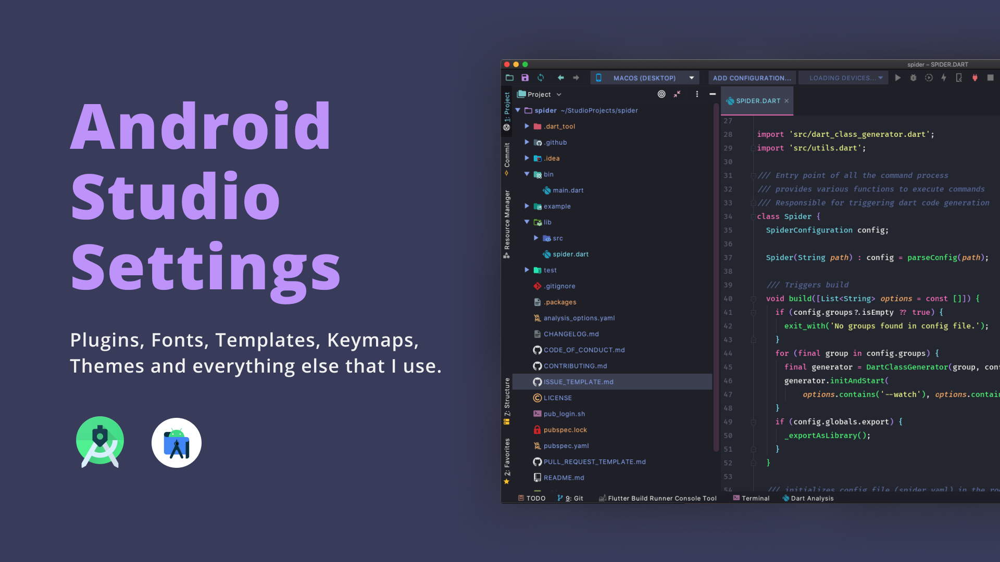
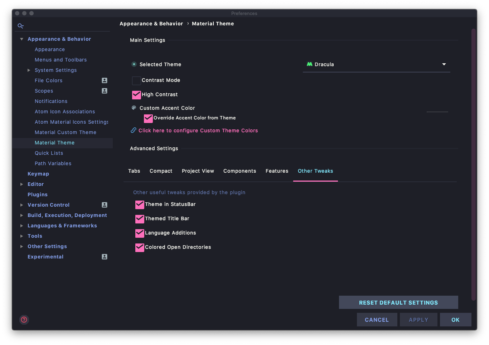
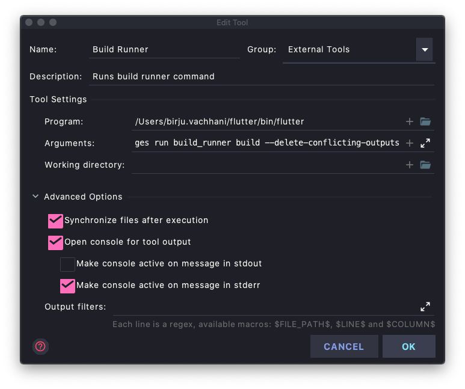

# Android Studio Settings

This repository contains almost all the information about the Android Studio configs that I use for my day to day Android and Flutter development.


## Look & Feel



#### Plugins

**[Material Theme UI](https://www.material-theme.com/):** For custom theme 

**Color Scheme:** Dracula (from Material Theme UI)

**[Atom Material Icons](https://plugins.jetbrains.com/plugin/10044-atom-material-icons/):** For awesome icons

**Arrow Styles**: Dracula

**[Nyan Progress Bar](https://plugins.jetbrains.com/plugin/8575-nyan-progress-bar/):** Pretty progress bars with nyan cat

**[Rainbow Brackets](https://plugins.jetbrains.com/plugin/10080-rainbow-brackets/):** Rainbow Brackets / Rainbow Parentheses

##### Other Material Theme Settings

```
High Contrast, Uppercase Bold Tabs, Themed Title Bar, 
```

##### Other Editor Settings

```
Highlight modified lines in the gutter, Change font size with command + Mouse Wheel
```


#### Editor Font

**Font:** [ Firacode (Medium)](https://github.com/tonsky/FiraCode) 

**Font Size**: 18

**Line Spacing:** 1.4

**Ligatures**: Enabled


#### Console Font

**Font:** [ Firacode (Retina)](https://github.com/tonsky/FiraCode) 

**Font Size**: 14

**Line Spacing:** 1.4

**Ligatures**: Enabled


## Plugins

- [Dart](https://plugins.jetbrains.com/plugin/6351-dart/)
- [Dart Data Class](https://plugins.jetbrains.com/plugin/12429-dart-data-class/)
- [Flutter](https://plugins.jetbrains.com/plugin/9212-flutter/)
- [Flutter Enhancement Suit](https://plugins.jetbrains.com/plugin/12693-flutter-enhancement-suite/)
- [Flutter Intl](https://plugins.jetbrains.com/plugin/13666-flutter-intl/)
- [Flutter Pub Version Checker](https://plugins.jetbrains.com/plugin/12400-flutter-pub-version-checker/)
- [Flutter Snippet](https://plugins.jetbrains.com/plugin/12348-flutter-snippets/)
- [Pub Assist](https://plugins.jetbrains.com/plugin/14412-pubassist/)
- [Shell Script](https://plugins.jetbrains.com/plugin/13122-shell-script/)


## File Templates

##### File Headers - Author Information

```
// Author: Birju Vachhani
// Created Date: ${MONTH_NAME_FULL} ${DAY}, ${YEAR}
```


## Live Templates

- [Gitmoji Android Live Templates](https://github.com/BirjuVachhani/gitmoji-android-live-templates)


## External Tools


##### Build Runner - Build

Runs flutter build runner with `--delete-conflicting-outputs` option.

**Keymap**: `cmd + shift + G`



## Terminal Shell

- [oh my zsh](https://github.com/ohmyzsh/ohmyzsh)

- [zsh](https://www.zsh.org/)


#### Downloads

You can download my exported settings and import it to yours. You can download it from [releases](https://github.com/BirjuVachhani/gitmoji-android-live-templates/releases). 


> Note that the downloadable settings only contains exported settings from Android Studio. So you will only find things that Android Studio allows to export.


#### Thank you.

If you find it helpful, don't forget to star the [repository](https://github.com/birjuvachhani/android-studio-settings).

